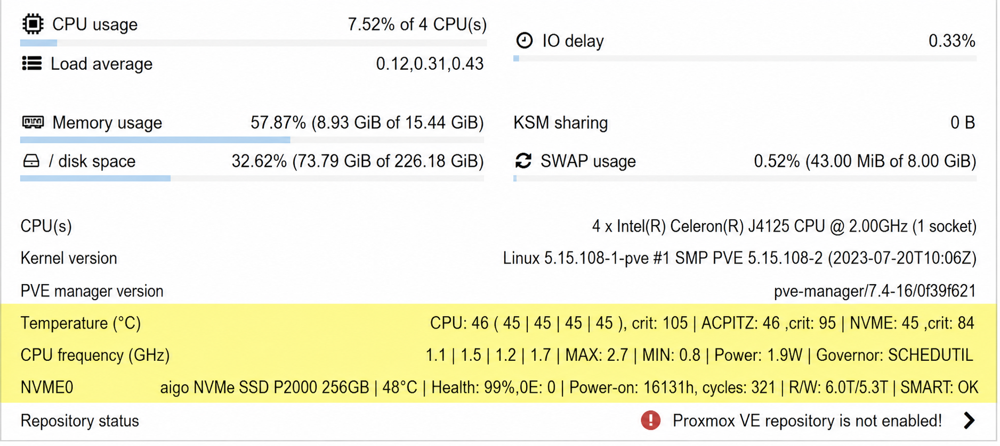

### Shell script

Adds CPU frequency, temperature, NVMe, SATA SSD, and SATA HDD status information to the Proxmox VE node summary page.

The script also includes the Proxmox VE 9 compatible subscription popup patch.

